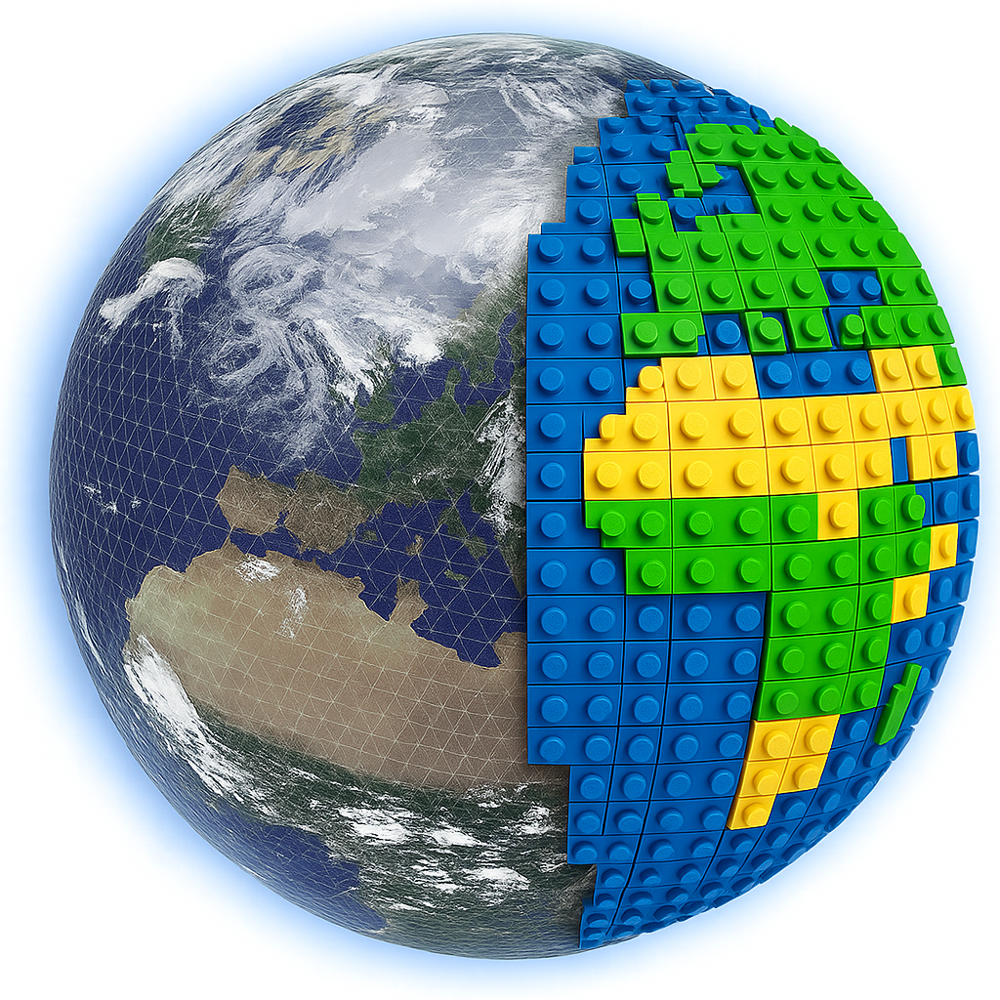

<p align="center">
  
</p>

# legoESM

**A Differentiable Earth System Model in JAX**

legoESM is a next-generation, fully differentiable Earth System Model spanning weather-to-climate timescales. Built from scratch in JAX, it enables end-to-end gradient computation for data assimilation, parameter estimation, and hybrid AI-physics modeling.

## Features

- **Differentiable-first**: End-to-end `jax.grad` through the full coupled model
- **Conservation as hard constraint**: Mass, energy, and momentum conserved via projection
- **Modular & swappable**: Standard tensor-in/tendency-out interface for AI or physics modules
- **Hardware-portable**: CPU, GPU (multi-GPU), TPU, and Apple Silicon
- **Multi-grid**: Cubed-sphere, lat-lon, Gaussian/spectral, Voronoi/MPAS, icosahedral

## Model Components

### Atmosphere
- **24 dynamical cores**: Shallow water, hydrostatic PE, non-hydrostatic CE across 8 discretizations (centered, FV/PPM, FC-Gram, C-grid) on cubed-sphere, lat-lon, and Gaussian grids, plus 2 SFNO learned cores
- **25+ physics schemes**: Radiation (gray + RRTMGP with diurnal cycle, ozone, cloud-radiation coupling), 5 convection backends, 6 microphysics backends, 8 turbulence backends (with PBL height diagnosis), 6 gravity wave drag backends, cloud fraction (Sundqvist, Xu-Randall)
- **Vertical coordinates**: Sigma and hybrid sigma-pressure (L20-L60, sinh stretching)

### Ocean
- **3D ocean dynamics**: Split-explicit baroclinic/barotropic, spectral ocean, SFNO ocean, FC-Gram ocean
- **Ocean physics**: KPP/Richardson/constant vertical mixing, harmonic/biharmonic/GM-Redi lateral mixing, surface forcing, bottom drag, convective adjustment
- **Biogeochemistry**: Abiotic carbon cycle (DIC+ALK, carbonate equilibria, air-sea CO2 flux) + NPZD ecosystem model
- **Simple ocean**: Slab mixed-layer and two-layer models

### Land Surface
- **Slab land**: Energy balance + bucket hydrology with stomatal conductance (Farquhar + Ball-Berry/Medlyn/Jarvis)
- **Multi-layer land**: Richards equation (mixed-form Picard, 6 retention curves: VG, CH, BC, Campbell, PDI, Lu) + Johansen thermal diffusion
- **Carbon cycle**: DALEC-990 6-pool (labile/foliage/root/wood/litter/SOM) with LUE GPP + seasonal scheme
- **Snow**: Accumulation/melt budget, age-dependent albedo, latitude-varying vegetation albedo

### Cryosphere
- **Sea ice**: Thermodynamic slab + free-drift + EVP rheology (Hunke & Dukowicz 1997), multi-category (Lipscomb 2001), temperature-dependent albedo

### Coupler
- **Tile-based coupling**: Ocean/ice/land/lake with area-weighted blending
- **Bulk flux**: COARE 3.0, Large & Yeager 2004, fixed-z0
- **Surface albedo**: Zenith-dependent ocean (Briegleb 1992), snow age decay, ice temperature feedback

### Diagnostics
- **Energy budget**: Column moist/dry static energy, TOA/surface flux tracking, dE/dt residual monitoring
- **Monthly means**: Zonal-mean profiles, global-mean scalars, multi-year accumulation

### External Forcing
- **GHG**: Constant or time-varying (NetCDF), CMIP6 experiment templates (piControl, historical, SSP2-4.5, SSP5-8.5, AMIP, 1pctCO2)
- **Ozone/Aerosol/Solar**: Climatological or time-varying from files
- **Real topography**: NetCDF loading with bilinear regridding, Laplacian smoothing, land fraction derivation

### Parallelism
- **Canonical parallel runtime** (`ParallelRuntime`): single entry point for serial, multi-GPU, MPI, and hybrid execution
- **Cubed-sphere sharding**: Face-level (1/2/3/6 devices) and sub-face tiling (6k² devices: 24, 54, 96, ...)
- **Lat-lon / level sharding**: Domain decomposition by latitude or vertical levels
- **Voronoi mesh decomposition**: Recursive coordinate bisection + METIS partitioning with halo exchange
- **Ensemble parallelism**: `vmap`-based vectorization + `NamedSharding` for multi-device, scan-based time integration with gradient checkpointing
- **MPI**: mpi4jax-based halo exchange and reductions for multi-node execution
- **Apple Silicon**: Metal/CPU hybrid routing

### CMIP Infrastructure
- **CF-compliant output**: `CFWriter` with CF-1.8, CMIP6 DRS naming, 27 variables (Amon + Lmon)
- **Restart/reproducibility**: SHA-256 state digests, config hashes, platform metadata
- **Tuning**: 16-parameter registry with resolution-appropriate defaults

## Quick Start

```bash
# Install
python -m venv .venv && source .venv/bin/activate
pip install -e ".[dev]"

# Run Williamson Test Case 2
legoesm test williamson --case 2 --resolution 48 --days 5

# Run tests
pytest tests/
```

## Platform Notes

### Compatibility Matrix

**Install minimum** (from `pyproject.toml`): Python ≥3.11, JAX ≥0.4.35, mpi4jax ≥0.8,<0.9 (optional), mpi4py ≥4.1,<5 (optional).

**Tested range** — the versions CI and benchmarks run against:

| Path | Hardware / Backend | MPI Runtime | Tested JAX | Tested mpi4jax | Status / Notes |
|---|---|---|---|---|---|
| Finite-volume dycores + ocean (single-process) | CPU (`jax` CPU backend) | N/A | `>=0.8,<0.10` | N/A | Regular unit/regression path |
| Finite-volume dycores + ocean (single-process) | Apple Silicon Metal (`jax-metal`) | N/A | `>=0.8,<0.10` | N/A | FV solvers only (`float32`); no `float64` |
| Spectral solvers (atmosphere/ocean) | CPU (`JAX_PLATFORMS=cpu`) | N/A | `>=0.8,<0.10` | N/A | Requires `float64`/`complex128`; not Metal-compatible |
| Distributed MPI halo/reductions | CPU + OpenMPI (`mpirun`) | OpenMPI 4.x/5.x | `>=0.8,<0.10` | `>=0.8,<0.9` | Validated with `mpirun -np 2/3/6` |
| Multi-device scaling suite | CPU/GPU (if available) | Optional | `>=0.8,<0.10` | `>=0.8,<0.9` (MPI mode) | `scripts/run_levante_gpu_scaling.py` |

JAX versions outside the tested range may work but are not guaranteed. Versions below the install minimum will fail at `pip install`.

`legoesm.parallel.reductions` enforces MPI compatibility guardrails at runtime:
- **Hard error** for `mpi4jax<0.8` (incompatible token semantics).
- **Warning** for JAX or mpi4jax outside the tested range. Set `LEGOESM_MPI_STRICT_COMPAT=1` to promote the warning to a hard error.

Detailed runbook for real hardware MPI/multi-GPU scaling:
- [docs/REAL_HARDWARE_SCALING.md](docs/REAL_HARDWARE_SCALING.md)

### Parallel Runtime & Supported Device Counts

The canonical entry point for all parallelism is `ParallelRuntime.create()`:

```python
from legoesm.parallel import ParallelRuntime
rt = ParallelRuntime.create(grid_type="cubed_sphere", grid_n=48)
```

**Supported cubed-sphere device/rank counts** (others are rejected with a precise error):
- **Face-only**: 1, 2, 3, 6
- **Sub-face tiling**: 6k² for k ≥ 2: 24, 54, 96, 150, 216, 294, 384, 600, ...

Unsupported counts (4, 5, 7, 8, 12, 36, 48, ...) raise `ValueError` with the nearest valid counts. There is no silent round-down.

**Execution modes**:
| Mode | Ranks | Devices/rank | Halo backend | Reduction backend |
|------|-------|-------------|-------------|-------------------|
| `serial` | 1 | 1 | local | local |
| `multi_device` | 1 | N | JAX SPMD | local |
| `mpi` | N | 1 | MPI | MPI |
| `hybrid` | N | M | MPI + JAX | MPI + JAX |

**Deprecated APIs**: `partition_state()` (zero-masked global arrays) emits `DeprecationWarning`. Use `ParallelRuntime.scatter()` / `.gather()` instead.

### Apple Silicon (Metal/MPS backend)

The **spectral solver** (Gaussian grid + spherical harmonic transforms) requires
`float64` and `complex128` arithmetic, which Apple's Metal backend does not support.

If you are on Apple Silicon and want to use the spectral solver, force the CPU backend:

```bash
JAX_PLATFORMS=cpu python your_script.py
```

The **finite-volume solvers** (cubed-sphere shallow water, hydrostatic primitive
equations) work on all backends including Metal, using `float32` precision.

To check your current JAX backend:

```bash
python -c "import jax; print(jax.default_backend())"
```

## Documentation

- [SPECIFICATION.md](SPECIFICATION.md) — Full technical specification (v3.8)
- [docs/implementation_summary.md](docs/implementation_summary.md) — Comprehensive summary of all implementations and tests
- [docs/cmip_readiness.md](docs/cmip_readiness.md) — CMIP production readiness checklist
- [docs/amip.md](docs/amip.md) — AMIP experiment guide
- [docs/ml_physics_parameterization.md](docs/ml_physics_parameterization.md) — Joint ML physics workflow and canonical moist run
- [docs/slab_s2s_documentation.md](docs/slab_s2s_documentation.md) — Shared NeuralGCM/SFNO slab-coupled S2S workflow and results layout
- [docs/REAL_HARDWARE_SCALING.md](docs/REAL_HARDWARE_SCALING.md) — Multi-GPU/MPI scaling guide

## Acknowledgments

legoESM bundles [jax-rrtmgp](https://github.com/climate-analytics-lab/jax-rrtmgp)
(Apache 2.0 license) for correlated-k radiation. jax-rrtmgp was developed by
Jeff Parker (Google), Duncan Watson-Parris (UCSD), and Juan Nathaniel (Columbia
University).

## License

MIT
